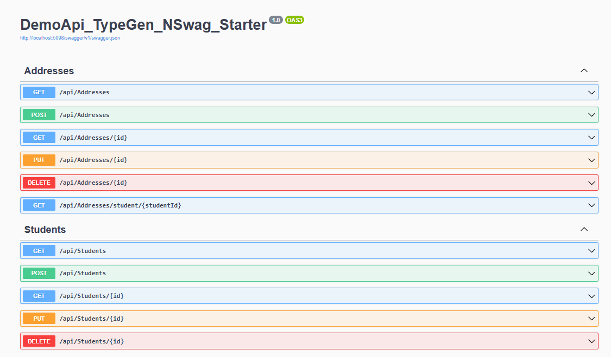

# DemoApi_TypeGen_NSwag_Starter

DemoApi_TypeGen_NSwag_Starter/
├─ src/
│  └─ DemoApi_TypeGen_NSwag_Starter/
│     ├─ Models/
│     │  └─ StudentDto.cs          ← for TypeGen (C# → TS models)
│     ├─ Services/
│     │  ├─ IStudentService.cs
│     │  └─ StudentService.cs
│     ├─ Controllers/
│     │  └─ StudentsController.cs  ← for NSwag (API → TS client)
│     ├─ Data/
│     │  ├─ Entities/
│     │  ├─ Configurations/
│     │  └─ ApplicationDbContext.cs
│     ├─ Validators/
│     ├─ ClientApp/                ← Angular application
│     ├─ Program.cs
│     ├─ typegen.json              ← TypeGen config
│     └─ nswag.json                ← NSwag config
└─ tests/
   └─ DemoApi.Tests/
      ├─ Services/
      ├─ Validators/
      └─ Helpers/

## Setup & Run

```bash
# Restore NuGet packages and dependencies
dotnet restore

# from root directory:
dotnet watch run --project src/DemoApi_TypeGen_NSwag_Starter
```

After the app starts, navigate to: http://localhost:5098/swagger

### NSwag Config (Keeping it Minimal)

The NSwag config lives at [src/DemoApi_TypeGen_NSwag_Starter/Spec/nswag.json](src/DemoApi_TypeGen_NSwag_Starter/Spec/nswag.json) and is intentionally minimal — only non-default options are kept for clarity. Some tools (like NSwag Studio "Save" or export) will re-expand defaults into the JSON; prefer editing the file manually if you want to keep it lean.

Key choices:
- **Serializer**: C# client uses Newtonsoft.Json (see [src/DemoApi_TypeGen_NSwag_Starter/DemoApi_TypeGen_NSwag_Starter.csproj](src/DemoApi_TypeGen_NSwag_Starter/DemoApi_TypeGen_NSwag_Starter.csproj) for the package reference).
- **DTO reuse**: The C# client sets `generateDtoTypes=false` and reuses models from [src/DemoApi_TypeGen_NSwag_Starter/Models](src/DemoApi_TypeGen_NSwag_Starter/Models).
- **Single client**: Operations are grouped via `SingleClientFromOperationId`.

Regenerate both TS and C# clients:

```powershell
cd src\DemoApi_TypeGen_NSwag_Starter\Spec
nswag run
```

## Code Generation Tools

### TypeGen (C# Models → TypeScript Interfaces)

> **Note:** TypeGen.DotNetCli currently has compatibility issues with modern .NET versions. The latest available version (2.4.7) requires .NET Core 2.2 which is end-of-life. For TypeScript model generation, consider:
> - Using NSwag's model generation capabilities (included in the API client generation below)
> - Manually creating TypeScript interfaces
> - Using alternative tools like [ts-generator](https://github.com/borisdamevin/ts-generator) or [CSharpToTypeScript](https://github.com/AdrianWilczynski/CSharpToTypeScript)

**If you still want to try TypeGen:**
```bash
# The configuration is in src/DemoApi_TypeGen_NSwag_Starter/typegen.json
dotnet tool install --global TypeGen.DotNetCli
cd src/DemoApi_TypeGen_NSwag_Starter
dotnet typegen generate
```

### NSwag (API Endpoints → TypeScript Client)

```bash
# Install NSwag globally (generates TypeScript API client from OpenAPI/Swagger)
dotnet tool install --global NSwag.ConsoleCore

# Generate TypeScript API client from your API endpoints (uses nswag.json config)
cd src/DemoApi_TypeGen_NSwag_Starter
nswag run
```

## Angular Client

The generated TypeScript files are organized in the `src/DemoApi_TypeGen_NSwag_Starter/ClientApp/src/app/` directory:

### Folder Structure
```
src/DemoApi_TypeGen_NSwag_Starter/ClientApp/src/app/
├─ models/           ← DTOs/Interfaces (StudentDto)
├─ services/         ← API Services (StudentsService)
├─ core/             ← Shared utilities (API_BASE_URL, SwaggerException)
└─ components/       ← Angular components (StudentsComponent)
```

### Running the Angular Application

```bash
# Navigate to the Angular app directory
cd src/DemoApi_TypeGen_NSwag_Starter/ClientApp

# Install npm dependencies
npm install

# Start the development server
ng serve

# Or use npm script
npm start
```

After the Angular app starts, navigate to: http://localhost:4200

### Module Configuration

Configure your Angular module with the generated services (see `app.module.example.ts`):

```typescript
providers: [
  StudentsService,
  { provide: API_BASE_URL, useValue: 'http://localhost:5098' }
]
```

## Security Note

CORS (Cross-Origin Resource Sharing) is configured in the API to allow the Angular app on `http://localhost:4200` to make requests to the API on `http://localhost:5098`. In production, update the CORS policy in `Program.cs` to only allow your actual frontend domain (e.g., `https://yourdomain.com`) instead of localhost for security.

## Screenshot



*Angular client successfully connected to the .NET API, displaying student data*

## Entity Framework Core Setup

### 1. Install Entity Framework Core Packages

```bash
# Install EF Core (compatible with .NET 9.0)
cd src/DemoApi_TypeGen_NSwag_Starter
dotnet add package Microsoft.EntityFrameworkCore --version 9.0.0
# Install SQL Server provider
dotnet add package Microsoft.EntityFrameworkCore.SqlServer --version 9.0.0
# Install EF Core tools for migrations
dotnet add package Microsoft.EntityFrameworkCore.Tools --version 9.0.0
```

### 2. Project Structure

```
src/DemoApi_TypeGen_NSwag_Starter/
├─ Data/
│  ├─ Entities/              ← Database entities (Student, Address)
│  ├─ Configurations/        ← Fluent API configurations
│  └─ ApplicationDbContext.cs
├─ Models/                   ← DTOs (StudentDto, AddressDto, CreateStudentRequest)
├─ Services/                 ← Business logic
├─ Validators/               ← FluentValidation validators
└─ Controllers/              ← API endpoints
```

### 3. Configure Connection String (User Secrets)

For security, store connection strings outside the project using User Secrets:

```bash
# Navigate to project directory
cd src/DemoApi_TypeGen_NSwag_Starter

# Initialize User Secrets for the project
dotnet user-secrets init

# Set SQL Server connection string
dotnet user-secrets set "ConnectionStrings:DefaultConnection" "Server=YOUR_SERVER\\SQLEXPRESS;Database=XXX;Trusted_Connection=True;TrustServerCertificate=True;"

# View the UserSecretsId in your .csproj file:
# <UserSecretsId>da6e5f64-13c1-4629-b98b-0f2f7606b3b8</UserSecretsId>

# Edit secrets file directly (optional):
notepad "%APPDATA%\Microsoft\UserSecrets\da6e5f64-13c1-4629-b98b-0f2f7606b3b8\secrets.json"
```

**Note:** Replace `YOUR_SERVER` with your actual SQL Server instance name. User Secrets are stored in:
- Windows: `%APPDATA%\Microsoft\UserSecrets\<user_secrets_id>\`
- macOS/Linux: `~/.microsoft/usersecrets/<user_secrets_id>/secrets.json`

User Secrets are automatically loaded in Development mode and never committed to source control.

### 4. Register DbContext in Program.cs

```csharp
builder.Services.AddDbContext<ApplicationDbContext>(options =>
    options.UseSqlServer(builder.Configuration.GetConnectionString("DefaultConnection")));
```


### 5. Create and Apply Migrations

```bash
# Install EF Core CLI tools globally (if not already installed)
dotnet tool install --global dotnet-ef --version 9.0.0

# Navigate to project directory (or use --project flag)
cd src/DemoApi_TypeGen_NSwag_Starter

# Create initial migration
dotnet ef migrations add InitialCreate

# Apply migrations to database (creates database and runs seed data)
dotnet ef database update

# List all applied migrations
dotnet ef migrations list

# Remove last migration (if not yet applied)
dotnet ef migrations remove

# Rollback all migrations (reset database)
dotnet ef database update 0

# Or run from root directory with --project flag:
dotnet ef migrations add InitialCreate --project src/DemoApi_TypeGen_NSwag_Starter
dotnet ef database update --project src/DemoApi_TypeGen_NSwag_Starter
```

**About __EFMigrationsHistory Table:**

EF Core automatically creates a `__EFMigrationsHistory` table in your database to track which migrations have been applied. This ensures:
- Migrations run only once
- Seed data inserted during migration won't be duplicated
- Multiple developers can sync database schema changes
- You can safely run `dotnet ef database update` multiple times - it only applies new migrations

## Testing

### Running Tests

```bash
# Run all tests
dotnet test

# Run tests with detailed output
dotnet test --verbosity detailed

# Run tests in a specific project
dotnet test tests/DemoApi.Tests

# Run specific test class
dotnet test --filter "FullyQualifiedName~CreateStudentRequestValidatorTests"

# Control output
dotnet test 2>&1 | Select-String "FAILED|Failed.*Passed"
```

### Test Structure

**Database Setup:** Each test class uses `IClassFixture<TestWebApplicationFactory>` with `EnsureDeleted()` followed by `EnsureCreated()` to ensure a fresh SQLite in-memory database state. This provides test isolation while keeping tests fast.

**Controller Integration Tests (17 tests):**
- **StudentsControllerTests**: Tests for student CRUD operations with validation (CreateStudent, UpdateStudent, DeleteStudent, GetAllStudents, GetStudentById)
- **AddressesControllerTests**: Tests for address operations (AddAddress, DeleteAddress, StudentWithMultipleAddresses scenarios)
- Uses WebApplicationFactory to test full HTTP stack with real routes and validation
✅ Fixed the dual EF Core provider registration issue (via the environment-based check in Program.cs)
✅ Set up WebApplicationFactory with SQLite for testing
✅ Fixed all controller test logic issues (routes, validation, status codes, data setup)
✅ Ensured proper database isolation per test class

**Service Tests (8 tests):**
- **StudentServiceTests**: Tests service layer logic for student operations
- **AddressServiceTests**: Tests service layer logic for address operations
- Uses in-memory SQLite database via TestDbContextFactory

**Validator Tests (2 tests):**
- **CreateStudentRequestValidatorTests**: Tests FluentValidation rules (StudentNo length, required fields, address constraints)

**Key Implementation Details:**
- StudentNo maximum length: 8 characters
- Province field is required for all addresses
- Database constraints enforce foreign key relationships
- All test data uses unique StudentNo values to avoid conflicts


# Cloudflared provides a secure tunneling service that exposes local or private services to the internet—without opening inbound ports.
git clone https://github.com/cloudflare/cloudflared.git
cd cloudflared
go build ./cmd/cloudflared
dotnet watch run --project src/DemoApi_TypeGen_NSwag_Starter --urls http://localhost:5098
./cloudflared tunnel --url http://localhost:5098 --loglevel debug
2026-01-03T02:05:27Z INF |  Your quick Tunnel has been created! Visit it at (it may take some time to be reachable):  |
2026-01-03T02:05:27Z INF |  https://diamond-grades-taxation-correct.trycloudflare.com                                 |
https://[domain]].trycloudflare.com/swagger/index.html
