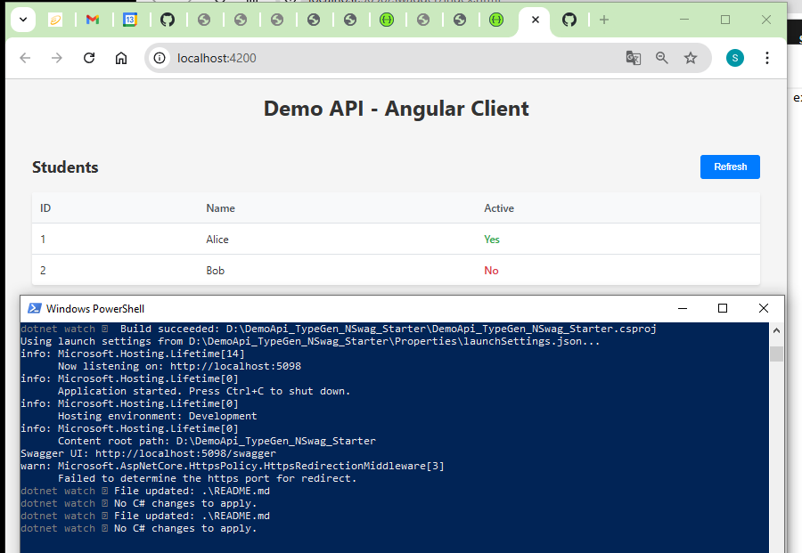

# DemoApi_TypeGen_NSwag_Starter

DemoApi/
├─ Models/
│  └─ StudentDto.cs          ← for TypeGen (C# → TS models)
├─ Services/
│  ├─ IStudentService.cs
│  └─ StudentService.cs
├─ Controllers/
│  └─ StudentsController.cs  ← for NSwag (API → TS client)
├─ Program.cs
├─ typegen.json              ← TypeGen config
└─ nswag.json                ← NSwag config

## Setup & Run

```bash
# Restore NuGet packages and dependencies
dotnet restore

# Run the application with hot reload (auto-restart on file changes)
taskkill /F /IM DemoApi_TypeGen_NSwag_Starter.exe; Start-Sleep -Seconds 1; dotnet watch run
```

After the app starts, navigate to: http://localhost:5098/swagger

## Code Generation Tools

### TypeGen (C# Models → TypeScript Interfaces)

> **Note:** TypeGen.DotNetCli currently has compatibility issues with modern .NET versions. The latest available version (2.4.7) requires .NET Core 2.2 which is end-of-life. For TypeScript model generation, consider:
> - Using NSwag's model generation capabilities (included in the API client generation below)
> - Manually creating TypeScript interfaces
> - Using alternative tools like [ts-generator](https://github.com/borisdamevin/ts-generator) or [CSharpToTypeScript](https://github.com/AdrianWilczynski/CSharpToTypeScript)

**If you still want to try TypeGen:**
```bash
# The configuration is in typegen.json, but the tool requires .NET Core 2.2
dotnet tool install --global TypeGen.DotNetCli
dotnet typegen generate
```

### NSwag (API Endpoints → TypeScript Client)

```bash
# Install NSwag globally (generates TypeScript API client from OpenAPI/Swagger)
dotnet tool install --global NSwag.ConsoleCore

# Generate TypeScript API client from your API endpoints (uses nswag.json config)
nswag run
```

## Angular Client

The generated TypeScript files are organized in the `ClientApp/src/app/` directory:

### Folder Structure
```
ClientApp/src/app/
├─ models/           ← DTOs/Interfaces (StudentDto)
├─ services/         ← API Services (StudentsService)
├─ core/             ← Shared utilities (API_BASE_URL, SwaggerException)
└─ components/       ← Angular components (StudentsComponent)
```

### Running the Angular Application

```bash
# Navigate to the Angular app directory
cd ClientApp

# Install npm dependencies
npm install

# Start the development server
ng serve

# Or use npm script
npm start
```

After the Angular app starts, navigate to: http://localhost:4200

### Module Configuration

Configure your Angular module with the generated services (see `app.module.example.ts`):

```typescript
providers: [
  StudentsService,
  { provide: API_BASE_URL, useValue: 'http://localhost:5098' }
]
```

## Security Note

CORS (Cross-Origin Resource Sharing) is configured in the API to allow the Angular app on `http://localhost:4200` to make requests to the API on `http://localhost:5098`. In production, update the CORS policy in `Program.cs` to only allow your actual frontend domain (e.g., `https://yourdomain.com`) instead of localhost for security.

## Screenshot



*Angular client successfully connected to the .NET API, displaying student data*

## Entity Framework Core Setup

### 1. Install Entity Framework Core Packages

```bash
# Install EF Core (compatible with .NET 9.0)
dotnet add package Microsoft.EntityFrameworkCore --version 9.0.0
# Install SQL Server provider
dotnet add package Microsoft.EntityFrameworkCore.SqlServer --version 9.0.0
# Install EF Core tools for migrations
dotnet add package Microsoft.EntityFrameworkCore.Tools --version 9.0.0
```

### 2. Project Structure

```
Data/
├─ Entities/              ← Database entities (Student, Address)
├─ Configurations/        ← Fluent API configurations
└─ ApplicationDbContext.cs
```

### 3. Configure Connection String (User Secrets)

For security, store connection strings outside the project using User Secrets:

```bash
# Initialize User Secrets for the project
dotnet user-secrets init

# Set SQL Server connection string
dotnet user-secrets set "ConnectionStrings:DefaultConnection" "Server=YOUR_SERVER\\SQLEXPRESS;Database=XXX;Trusted_Connection=True;TrustServerCertificate=True;"

<UserSecretsId>da6e5f64-13c1-4629-b98b-0f2f7606b3b8</UserSecretsId>

notepad "C:\Users\baosh\AppData\Roaming\Microsoft\UserSecrets\da6e5f64-13c1-4629-b98b-0f2f7606b3b8\secrets.json"
```

**Note:** Replace `YOUR_SERVER` with your actual SQL Server instance name. User Secrets are stored in:
- Windows: `%APPDATA%\Microsoft\UserSecrets\<user_secrets_id>\`
- macOS/Linux: `~/.microsoft/usersecrets/<user_secrets_id>/secrets.json`

User Secrets are automatically loaded in Development mode and never committed to source control.

### 4. Register DbContext in Program.cs

```csharp
builder.Services.AddDbContext<ApplicationDbContext>(options =>
    options.UseSqlServer(builder.Configuration.GetConnectionString("DefaultConnection")));
```


### 5. Create and Apply Migrations

```bash
# Install EF Core CLI tools globally (if not already installed)
dotnet tool install --global dotnet-ef --version 9.0.0

# Create initial migration
dotnet ef migrations add InitialCreate

# Apply migrations to database (creates database and runs seed data)
dotnet ef database update

# List all applied migrations
dotnet ef migrations list

# Remove last migration (if not yet applied)
dotnet ef migrations remove

# Rollback all migrations (reset database)
dotnet ef database update 0
```

**About __EFMigrationsHistory Table:**

EF Core automatically creates a `__EFMigrationsHistory` table in your database to track which migrations have been applied. This ensures:
- Migrations run only once
- Seed data inserted during migration won't be duplicated
- Multiple developers can sync database schema changes
- You can safely run `dotnet ef database update` multiple times - it only applies new migrations

